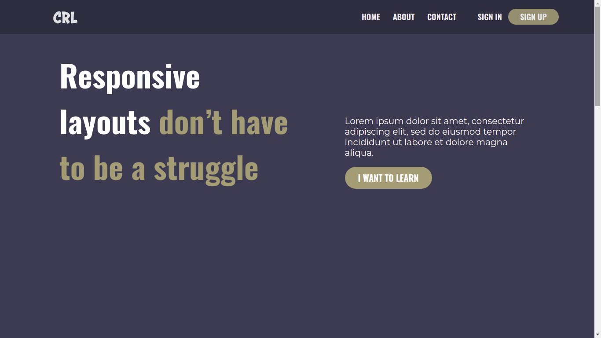

https://joaoreisjpk.github.io/KevinPowell--ConsolidandoCSS/

### Kevin-Powell CSS Challenge

Desafio do curso de 21 Days With Kevin Powell https://courses.kevinpowell.co/conquering-responsive-layouts

[Link para o Site](https://joaoreisjpk.github.io/KevinPowell--ConsolidandoCSS/)

# Habilidades desenvolvidas.

-Aprender como fazer um site completamente responsivo  

-Aprender todas as ferramentas do Flex-Box como:  

  -Justify-Content/ Align-Self/ Align-Itens/ Align-Content  

  -Flex-Wrap/ Flex-Flow/ Flex-Shrink/ Flex-Grow/ Flex-Direction   

  -Gap/ Order/ Flex-Basis  

# O que foi desenvolvido.

Um site simples, porém completamente responsivo, cujo layould retrata uma revista;
